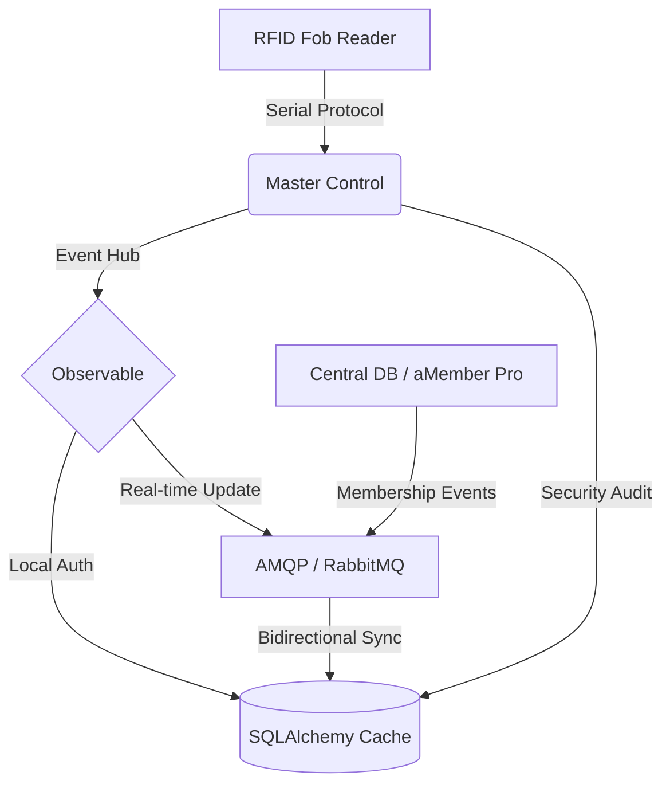

# 🛠️ Master Control (MCP)

**Enterprise-Grade IoT Access Control Gateway**

Master Control (MCP) is a high-availability software engine designed to manage physical access control systems in makerspaces and hackerspaces. It serves as a mission-critical bridge between RFID hardware readers, local persistent storage, and centralized membership management via distributed message queues.

---

## 🌟 Professional Highlights

- **Fault-Tolerant Hybrid Persistence**: Engineered a dual-backend system that maintains a local SQL cache, ensuring 99.9% uptime for door access even during network partitions or cloud service outages.
- **Real-Time Distributed Sync**: Implemented AMQP (RabbitMQ) integration for live synchronization of membership data, subscription renewals, and fob updates from centralized web services (aMember Pro).
- **Modern Python Architecture**: Modernized legacy Python 2.7 code to Python 3.10+, implementing strict typing, asynchronous monitoring, and SQLAlchemy 2.0 ORM patterns.
- **Hardware Integration**: Developed asynchronous serial monitoring for hardware RFID readers with automated heartbeat tracking and system health diagnostics.
- **Event-Driven Design**: Utilized the Observable pattern to decouple core logic from event handlers, enabling scalable extensions for logging, notifications, and analytics.

---

## 🏗️ System Architecture



---

## 🛠️ Technical Stack

- **Core**: Python 3.10+ (Type Hinting, Asynchronous IO)
- **Persistence**: SQLAlchemy 2.0 (PostgreSQL, MySQL, SQLite)
- **Messaging**: RabbitMQ / AMQP (Enterprise messaging)
- **Hardware**: PySerial (Hardware/Firmware communication)
- **Design Patterns**: Observable (Event-Driven), Repository, Singleton

---

## 🚀 Key Features

- **Offline-First Resilience**: Local database caching allows the system to operate autonomously without an internet connection.
- **Extensible Plugin System**: Modular design for adding new hardware devices or notification drivers (e.g., Matrix, Discord, Slack).
- **Comprehensive Auditing**: Automatic logging of every access attempt with real-time reporting to central dashboards.
- **Security-First**: Robust error handling for serial communication and database transactions.

---

## 📦 Installation & Deployment

1. **Setup Environment**
   ```bash
   git clone https://github.com/rohankar02/Master-Control.git
   cd Master-Control
   python -m venv venv
   source venv/bin/activate
   pip install -r requirements.txt
   ```

2. **Configure System**
   ```bash
   cp config/template.ini config/mastercontrol.ini
   # Edit config/mastercontrol.ini with your credentials
   ```

3. **Initialize & Run**
   ```bash
   python mastercontrol.py
   ```


