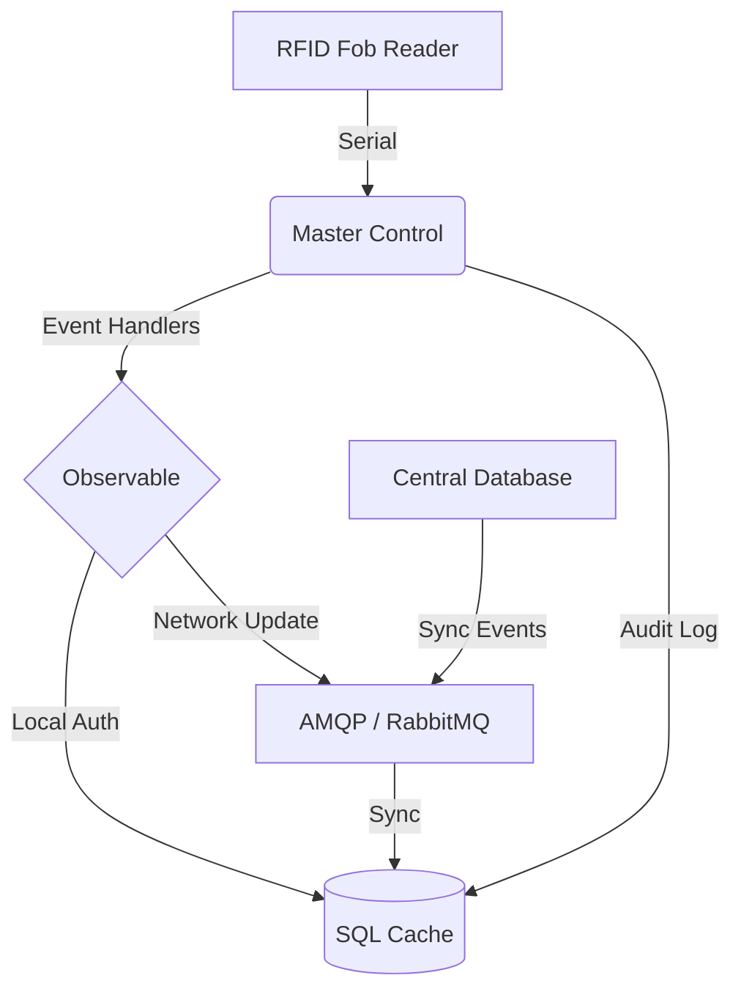

# 🛠️ Master Control (MCP)

**A Robust Hardware-to-Cloud Access Control Gateway**

[](https://www.python.org/downloads/)
[](https://www.sqlalchemy.org/)
[](https://opensource.org/licenses/MIT)

Master Control (MCP) is the mission-critical software engine powering the door access systems at [ENTS](http://ents.ca). It acts as a bridge between physical RFID hardware (Serial/Arduino), local persistent storage (SQL), and central membership management (AMQP/RabbitMQ).

---

## 🚀 Key Features

- **Hybrid Persistence**: Maintains a local SQL cache for zero-latency door response, even during network partitions.
- **Real-time Synchronization**: Uses AMQP (RabbitMQ) to listen for membership updates (fob changes, subscription renewals) from a centralized aMember Pro system.
- **Hardware Integration**: Asynchronous monitoring of serial devices for RFID fob events with automatic heartbeat tracking.
- **Observable Pattern**: Decoupled core logic using an event-driven architecture to handle door unlocks, system pings, and logging.
- **Professional Scalability**: Upgraded to modern Python 3.9 standards with SQLAlchemy 2.0 and strict typing.

---

## 🏗️ System Architecture



---

## 🛠️ Technical Stack

- **Language**: Python 3.9+ (Modernized from 2.7)
- **Database**: SQLAlchemy 2.0 (PostgreSQL/MySQL/SQLite compatible)
- **Communication**: AMQP (via Pika) for distributed events; PySerial for hardware communication.
- **Architecture**: Event-driven (Observable), Threaded background workers.

---

## 📦 Installation & Setup

1. **Clone & Environment**
   ```bash
   git clone https://github.com/rohankar02/Master-Control.git
   cd Master-Control
   python -m venv venv
   source venv/bin/activate
   pip install .
   ```

2. **Configuration**
   Copy the template and configure your database and AMQP credentials:
   ```bash
   cp config/template.ini config/mastercontrol.ini
   ```

3. **Running the System**
   ```bash
   master-control
   ```

---

## 📄 License

This project is licensed under the MIT License - see the [LICENSE](LICENSE) file for details.

---
*Created with ❤️ for hackerspaces.*
